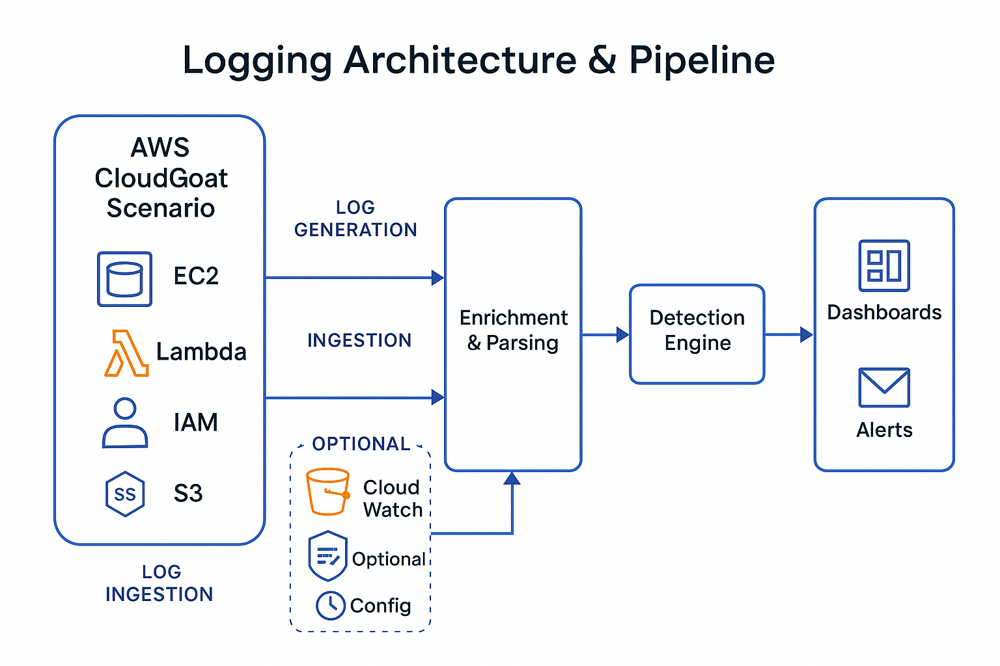

# Logging Architecture & Pipeline

This diagram illustrates the log and data flow from AWS services to Sumo Logic and how detection logic is applied across scenarios.

---

---

## 🔄 Data Flow Overview

1. **AWS CloudGoat Scenario**
   - Deploys resources (EC2, Lambda, IAM, etc.)

2. **Log Generation**
   - CloudTrail captures API activity
   - VPC Flow Logs track network metadata
   - Lambda writes stdout/stderr to CloudWatch
   - S3 logs bucket access activity

3. **Ingestion**
   - S3 Bucket → Sumo Logic S3 Source
   - CloudWatch → Cloud-to-Cloud integration
   - Optional: GuardDuty + Config → Sumo ingestion

4. **Parsing & Enrichment**
   - Field Extraction Rules parse logs
   - Metadata (e.g., IP location, role info) enriched

5. **Detection Engine**
   - Detections run as Scheduled or Real-Time Searches
   - Monitors generate alerts when thresholds or patterns match

6. **Dashboards / Alerts**
   - Results visualized in dashboards
   - Alerts forwarded to email, Slack, PagerDuty, etc.

---

## 📌 Notes

- Use source categories to separate log types (e.g., `aws/cloudtrail`, `aws/lambda`)
- FERs should be tuned for fields like `eventName`, `userIdentity`, `sourceIPAddress`
- Consider tagging all CloudGoat resources for easier filtering
